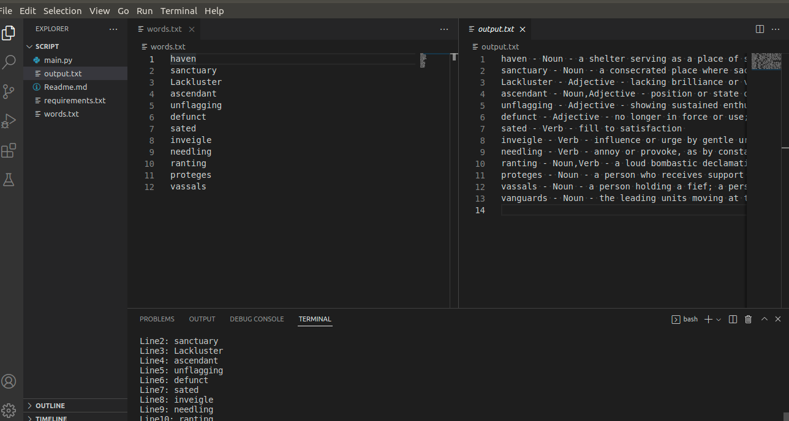

### Meaning Finder

**Prerequesties**
- PyDictionary
- Internet connection

**Usage**
- python3 main.py

**Explanation**
- Write your words in each line without spelling mistakes in words.txt
- Using internet connection Pydictionary fetches content and gives you the meaning
- You would get your output in output.txt file
- Usefull while finding meaning for 1000's of words

**Visuval**
